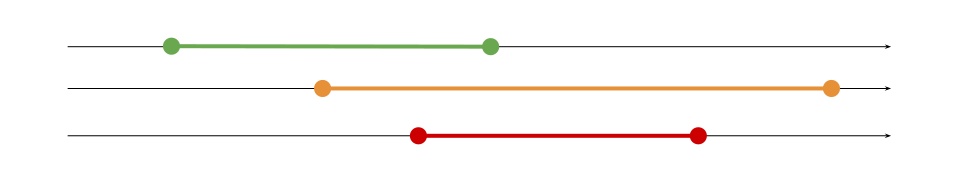

# Ranges

Ranges is a Go package that implements range overlap calculation.

## Overview

A range represents an interval between two values called start and end. For example, ranges can be used to represent time intervals.


Ranges can be assigned a priority value. In the figure below, the green range has a low priority, the yellow range has an intermediate priority and the red one has the highest priority.



This package allows to turn a list of potentially overlapping ranges into a sequence of ranges which do not overlap and preserve the highest priority.


## Usage

This package models a range with the struct

```go
type Range struct {
	Start, End int
	Priority   int
}
```

The priority of a range is a non-negative integer. Increasing numbers (0, 1, 2, 3...) represent decreasing priority, with 0 being the highest. For example, in the figure above, the red, yellow and green ranges could have priority 0, 1, 2 respectively.

Once you have built a set of potentially overlapping ranges, you can use the function `Overlap` to combine them into a sequence.

```go
func Overlap(ranges []Range) []Range
```

The ranges of the computed sequence are guaranteed not to overlap, and they will be assigned the highest priority (i.e. lowest value) computed from the input.

## Example

Here is the code of a program that computes and prints the overlap of 3 ranges.

```go
package main

import (
	"fmt"

	"github.com/lorciv/ranges"
)

func main() {
	data := []ranges.Range{
		{Start: 5, End: 25, Priority: 2},
		{Start: 10, End: 20, Priority: 1},
		{Start: 13, End: 17, Priority: 0},
	}
	for _, r := range ranges.Overlap(data) {
		fmt.Printf("%2d -> %2d (priority %d)\n", r.Start, r.End, r.Priority)
	}
}
```

Here is the output.

```
 5 -> 10 (priority 2)
10 -> 13 (priority 1)
13 -> 17 (priority 0)
17 -> 20 (priority 1)
20 -> 25 (priority 2)
```

And here is the graphical view of the same calculation.


Have fun!
